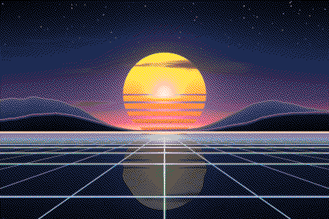

# PixelSynth

[](https://github.com/m4rcone/pixel-synth/actions/workflows/ci.yml)

A free online dithering and pixel art tool. Turn any photo into dithered, 1-bit or pixel art images right in your browser: pick one of 17 dithering algorithms, dither to a classic palette like Game Boy, NES or PICO-8, separate it into CMYK inks, tune the look, share it as a link and export a crisp PNG or animated GIF. No uploads, no accounts, no watermark.

**Live:** https://pixelsynth.art

<p align="center">
  
</p>

## Features

### Dithering

- **17 algorithms**: error diffusion (Floyd–Steinberg, Stucki, Atkinson…), ordered (Bayer, clustered dot, blue noise), noise-based (random, void-and-cluster) and halftone screens (round, square or diamond dots, or lines, at any size and angle; lines can be lifted by the light or waved).
- **Error diffusion strength**: pass on less of each pixel's rounding error for flatter areas with fewer stray dots.
- **1-bit dot colors**: tint the dots by brightness band (shadows, midtones, highlights) on a background of any color, or a transparent one to lay the dither over other artwork.
- **Filters**: levels (black point, gamma, white point), contrast, brightness, saturation, sharpen, noise and blur.

### Color

- **Palettes**: 17 classic palettes (Game Boy, PICO-8, NES, CGA, EGA, ZX Spectrum, C64, MSX, Apple II, sepia, cyanotype, riso…), a palette extracted from your image (2 to 64 colors) or your own colors, matched by color or by brightness.
- **Palette import**: paste hex codes or open a palette file (Lospec's HEX, GPL, PAL or Paint.NET TXT).
- **CMYK**: each ink dithered on its own and overprinted on white, like a four-color press; halftone screens take the classic angles and form rosettes.
- **Pixel art preset**: one click shrinks any image to about 128 × 96 pixels' worth of detail and applies PICO-8 with a 2×2 Bayer pattern.

### Input and output

- **Any image**: drop, paste or pick a PNG, JPEG, WebP, GIF, AVIF or BMP, or start from the built-in samples.
- **Animated GIF**: up to 300 frames, played or stepped frame by frame, dithered with one shared palette and saved with the original timing.
- **Crisp export**: PNG or GIF at ×1, ×2, ×4 or ×8, enlarged nearest-neighbor. Dithered images are saved as indexed PNGs, several times smaller than a browser's RGBA PNG with identical pixels.
- **Share settings**: a link that reopens the editor with the same look. It carries the settings only, never your image.
- **Live before/after**: pan, zoom, pinch and compare with a split view or a toggle.

### Private, fast and accessible

- **100% client-side**: every pixel is computed on your device; nothing is uploaded. Analytics count page views only.
- **Fast**: a 4-megapixel image dithers in roughly 0.1–0.35 s on a recent laptop.
- **Accessible**: works on desktop and mobile, fully keyboard-operable, respects reduced motion, axe-tested on every route.

## Pages and links

| Route                | What it is                                                             |
| -------------------- | ---------------------------------------------------------------------- |
| `/`                  | Landing page: before/after hero, algorithms, palettes, GIFs, FAQ       |
| `/editor`            | The editor                                                             |
| `/algorithms`        | The algorithm catalog, grouped by family (`#algorithm-<slug>` anchors) |
| `/algorithms/<slug>` | One guide per algorithm: its kernel or threshold matrix, before/after  |
| `/palettes`          | The palette gallery (`#palette-<id>` anchors)                          |
| `/palettes/<slug>`   | Guides to the best-known palettes (Game Boy, PICO-8, NES, C64, CGA, …) |

The editor accepts deep links, which can be combined:

- `/editor?algorithm=<slug>` preselects an algorithm (e.g. `?algorithm=atkinson`)
- `/editor?palette=<id>` switches to palette mode with that palette (e.g. `?palette=gameboy`)
- `/editor?preset=pixel-art` applies the pixel art preset to the next image you load
- `/editor?sample=1` opens the editor on the sample image; `?sample=animated` on the animated sample
- `/editor?s=<code>` reopens the editor with shared settings (the link icon in the control panel copies one)

Every page has its own metadata, Open Graph image and structured data; `/sitemap.xml` lists all of them.

## How it works

An image is decoded in the browser, scaled down to the processing size and handed to a Web Worker, which runs the pipeline on plain RGBA buffers:

1. **Downscale** by area averaging (alpha-aware, so cutouts keep clean edges).
2. **Filters**: levels, contrast, saturation, sharpen, blur, noise.
3. **Dither**: 1-bit with tone mapping, to a palette, or per CMYK ink.

The result stays at the processing resolution; the viewport and the export enlarge it nearest-neighbor, so every pixel remains a sharp block. The pipeline has no dependencies (typed arrays only) and lives in [`src/lib/editor/`](src/lib/editor/); the GIF and indexed-PNG encoders are written from scratch there too.

## Feedback

- **Found a bug?** [Open a bug report](https://github.com/m4rcone/pixel-synth/issues/new?template=bug.yml). From the editor, "Report a bug" in the help menu fills in your settings and browser for you (never your image).
- **Have an idea?** [Suggest a feature](https://github.com/m4rcone/pixel-synth/discussions/new?category=ideas) in Discussions, or vote for an existing one.

## Tech stack

- **Next.js** (App Router, all routes statically prerendered) · **React** · **TypeScript**
- **Tailwind CSS** · **shadcn/ui** (Radix UI) · lucide icons
- A dependency-free image pipeline (typed arrays + Web Worker) and a Canvas 2D viewport
- **Vitest** (engine and pure logic) · **Playwright + axe** (end-to-end and accessibility)
- Deployed on **Vercel**

## Getting started

Requires **Node 24** (see `.nvmrc`).

```bash
git clone https://github.com/m4rcone/pixel-synth.git
cd pixel-synth
npm install
npm run dev
```

Then open http://localhost:3000.

### Scripts

| Script                               | What it does                                                                                                                         |
| ------------------------------------ | ------------------------------------------------------------------------------------------------------------------------------------ |
| `npm run dev`                        | Start the dev server                                                                                                                 |
| `npm run build` / `npm start`        | Production build / run it                                                                                                            |
| `npm run lint:eslint`                | Lint, including accessibility rules (jsx-a11y)                                                                                       |
| `npm run lint:prettier`              | Format everything with Prettier                                                                                                      |
| `npm run format:check`               | Check formatting without writing                                                                                                     |
| `npm run typecheck`                  | Type-check with `tsc`                                                                                                                |
| `npm test`                           | Unit and end-to-end tests                                                                                                            |
| `npm run test:unit`                  | Engine and logic tests (Vitest)                                                                                                      |
| `npm run test:e2e`                   | End-to-end, accessibility and SEO tests (Playwright). Starts a dev server on `PORT` (3000), or set `BASE_URL` to reuse a running one |
| `npm run test:a11y`                  | Only the accessibility tests                                                                                                         |
| `npm run perf:bundles`               | Per-route JavaScript size table (after `npm run build`)                                                                              |
| `node scripts/generate-previews.mjs` | Regenerate the sample images and every preview with the current engine                                                               |

## Contributing

Bug reports and ideas are welcome through the links above. For code changes:

- Run the whole gate before opening a pull request: `lint:eslint`, `format:check`, `typecheck`, `test:unit`, `build` and `test:e2e`. CI runs the same steps on every pull request.
- After changing the engine or a palette, run `node scripts/generate-previews.mjs` and commit the regenerated images; never edit them by hand.
- Keep it light: ask before adding a runtime dependency, and prefer platform APIs (Canvas 2D, Workers).
- Every route must pass axe; interactive canvases need keyboard equivalents.
- Commits follow the conventional style (`feat:`, `fix:`, `refactor:`, `perf:`, `chore:`).

## Credits

- Fonts: [Sixtyfour](https://github.com/jenskutilek/homecomputer-fonts) by Jens Kutilek and [Azeret Mono](https://github.com/displaay/azeret) by Displaay, both under the SIL Open Font License.
- Palette colors follow each system's reference (Pan Docs, NESdev, the PICO-8 manual, IBM's CGA and EGA documentation); imported palettes read Lospec's formats.
- The dithering algorithms are credited to their authors on each algorithm page.
